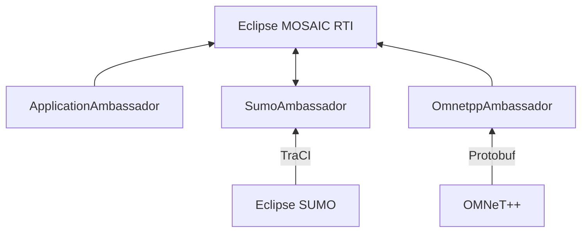

# Overview

The runtime infrastructure of **Eclipse MOSAIC** couples different simulators and can't be run alone 
and, therefore, it requires pre-installed simulators. Each simulator coupled with the RTI of MOSAIC usually covers a specific 
domain (e.g. traffic, communication, application, electricity, or other). 

Each of the simulators must implement an interface, the so-called `Ambassador`. 
The ambassador communicates with the actual simulator, which is represented by the `Federate`. 
For some cases, if the simulator is directly coupled with the RTI (e.g. Application, or cell), the ambassador also 
represents the federate. This architecture allows a simple coupling of own simulators.

---

The following simulators are already coupled with MOSAIC:

## Traffic / Vehicle Simulation

||| 
|-|-|
| [**Eclipse SUMO**](</docs/simulators/sumo/>) | Microscopic Traffic simulation. |
| **PHABMACS**     | Sub-microscopic vehicle simulation with 3D visualization. |

## Network / Communication Simulation

||| 
|-|-|
| [**OMNeT++**](</docs/simulators/omnetpp/>) | Event-based network simulator for ITS-G5 and cellular communication. |
| [**ns-3**](</docs/simulators/ns-3/>) |  Event-based network simulator for ITS-G5 and cellular communication. |
| [**MOSAIC Simple Network Simulator**](</docs/simulators/sns/>) | Simulator for ITS-G5 ad-hoc communication using simplified models. |
| [**MOSAIC Cell**](</docs/simulators/cell/>) |  Simulator for cellular communication. |

## Application Simulation

|||  
|-|-|
| [**MOSAIC Application**](</docs/simulators/application_simulator/>) | Application prototyping and simulation. |

## Environment Simulation 

||| 
|-|-|
| [**MOSAIC Environment**](</docs/simulators/environment_simulator/>) | Environmental event simulation.|

## E-Mobility Simulation 

||| 
|-|-|
| [**MOSAIC Battery**](</docs/simulators/battery_simulator/>) | Electric vehicle simulation. |