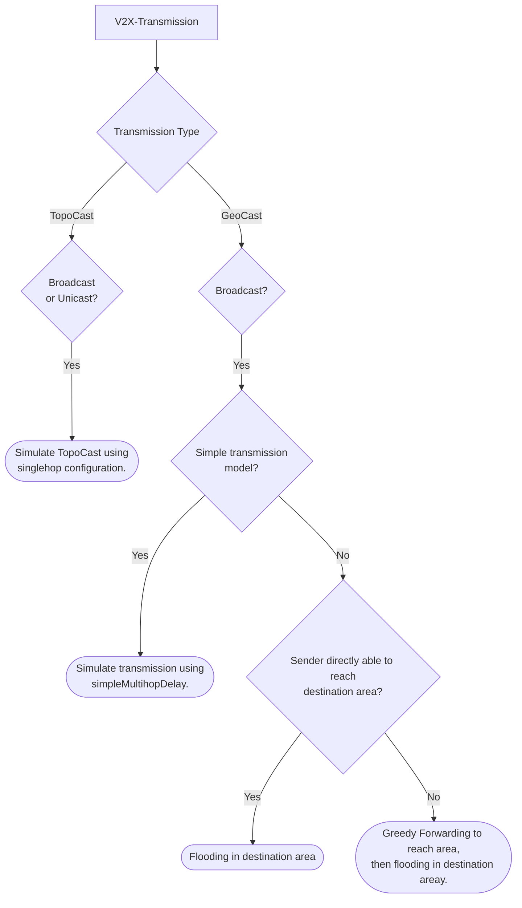

The Simple Network Simulator (SNS) aims to provide simple and fast capabilities for the
transmission of V2X-messages using Ad hoc communication. In order to stay performant the simulator makes abstractions
in certain places. Those abstractions will be discussed later on.

## Configuration
The SNS offers some configurability regarding the way transmissions are simulated.

__Main Configuration:__

|Parameter                |Description                                                                                                      |type                    |Default Value                   |
|:------------------------|:----------------------------------------------------------------------------------------------------------------|:-----------------------|:-------------------------------|
|`maximumTtl`             | Defines the upper bound for the amount of hops a message can make. (Note: messages can have individual `ttl`'s) | int                    | `10`                           |
|`singlehopRadius`        | Fallback radius to be used for transmission, if no radius is defined in the `AdhocConfiguration`                | double                 | `509.4`                        |
|`singlehopDelay`         | A delay configuration for the direct communication between two nodes. ([See here]())   | Delay  | `ConstantDelay       |
|`singlehopTransmission`  | This contains the transmission configurations for `lossProbability` and `maxRetries`.                           | CTransmission          | n/a                            |
|`adhocTransmissionModel` | A class extending `AdhocTransmissionModel`, this will decide the logic for transmissions.                       | AdhocTransmissionModel | `SimpleAdhoc TransmissionModel` |

> On default the SNS will use the `SimpleAdhocTransmissionModel` with a `ConstantDelay` using 0 as delay. This means it usually
> makes sense to specify the `AdhocTransmissionModel` explicitly and use a more realistic `Delay`.
__Example Configuration:__
```json
{
    "maximumTtl": 20,
    "singlehopRadius": 300.5,
    "singlehopDelay": {
        "type": "SimpleRandomDelay",
        "steps": 5,
        "minDelay": "1.5 ms",
        "maxDelay": "2.5 ms"
    }, 
    "singlehopTransmission": {
        "lossProbability": 0.0,
        "maxRetries": 0
    },
    "adhocTransmissionModel": {
        "type": "SimpleAdhocTransmissionModel",
        "simpleMultihopDelay": {
            "type": "GammaRandomDelay",
            "minDelay": "10 ms",
            "expDelay": "30 ms"
        },
        "simpleMultihopTransmission": {
            "lossProbability": 0.1,
            "maxRetries": 2 
        }
    }
}
```

## Transmission Logic
SNS differentiates between two types of Ad hoc transmissions, geographically- and topologically-scoped transmissions, which
generally are abbreviated with _GeoCast_ and _TopoCast_ respectively.  
GeoCasts are limited to _BroadCasts_. Accordingly, there is no explicit addressing
of receivers (other than 255.255.255.255), instead a destination area is specified. However, GeoCasts allow for multihop forwarding.  
TopoCasts on the other hand use means of IPv4 addressing to transmit messages. Since the SNS was not build to simulate transmissions using complex topology-constructs, TopoCasts
are limited to transmissions with a single hop. However, TopoCasts support _BroadCasts_ and _UniCasts_ (we are omitting Anycasts).
Most transmissions in the Ad hoc domain will be some form of Broadcast, meaning every reachable entity is eligible to
receive a message.  
The flowchart below tries to explain how different types of messages are handled internally.



<!---
<svg xmlns="http://www.w3.org/2000/svg" xmlns:xlink="http://www.w3.org/1999/xlink" version="1.1" width="596" viewBox="-0.5 -0.5 596 607" content="&lt;mxfile host=&quot;Electron&quot; modified=&quot;2020-07-06T10:48:36.527Z&quot; agent=&quot;Mozilla/5.0 (Windows NT 10.0; Win64; x64) AppleWebKit/537.36 (KHTML, like Gecko) draw.io/12.4.2 Chrome/78.0.3904.130 Electron/7.1.4 Safari/537.36&quot; etag=&quot;l4Q-Cp_AUSgKvp2rzn64&quot; version=&quot;12.4.2&quot; type=&quot;device&quot; pages=&quot;1&quot;&gt;&lt;diagram id=&quot;9cMP8hRPBYysTayQNTAi&quot; name=&quot;Page-1&quot;&gt;7Vvblps2FP0aP5qlCwL8OJek7epKV1cnaTOPjNHYJBhRIWdm+vWVQBgLaTB2jZMm+MXW0QXQ2dpb5wjP8M3m+SceF+t3LKHZDIHkeYZvZwhBGEbyS1leaksQktqw4mmiG7WGu/Qfqo1AW7dpQkujoWAsE2lhGpcsz+lSGLaYc/ZkNntkmXnVIl5Ry3C3jDPb+leaiHVtjQBo7T/TdLXWVw6bik3ctNWGch0n7GnPhN/M8A1nTNS/Ns83NFNz10xL3e/tK7W7++I0F0M6/Hq/+rTOil9uE579QePoU/jhaY71zX2Js61+4Csh6KYQ0nhVFJzFy3War2SJx3m5ScsyZXnlA2WisraaZxrP0I0yr6mqfZsxlljdPD0R4qWZXM62eULVDcIZvn5ap4LeFfFS1T5JOElbnKWrXBaX8ikpVwa+1CAhQBbXYpPp7ln8QLNrxhPKb1jGZOPbnOV0VxMvP6+qC3ZqH9Ms65pYLhrTDGFQfaS9FJx9pq4aPY2UC/r8qoPgzu1yuVC2oYK/yCa6QwB8j4QkQHqB6AVDAl1+auEHfe23tQE9jXqN+NXuCi0q5A8NjCNAAi2M/Ik+zt8bgDjasd+R41AYeVFgOA07fIYcPgvG8plv+czyEc2TK0WQanVlsfTjUk4HfU7FR2kBHtGle+0l9ftWPTFoCi9NIZd3vNdJFe/369puVanpdw4InOhvmlis3/G2nCq25Ut6eF2ImK+o6GkXudGzhw3igEZj4zSLRfrFvF0XXvQVfmdpLlpwQijBSRZ7HwOoaEHMEeun1oPsy0lnXBRZoIe4M1Y9M9ZYFaB3E3E6xomF8fesYDdxKY7E+oT0A0iPBiIdol6iBB7GIDQwM4eRxZQjrgZMbNSeugJ8aI8VDlsB7VhNQ/b4WNJRVknkUIIgExpSxjIJ/t6ypmJeVrusK9lgUTy3dfLXSn2b8g/evxS0GVfeZj103dLeHKzZ5mFbDt3xfU87hQX0kG/u76Bjr7AgHsIX3OEtLIzIez+eSOFEpOci0n4cAU9SGTJh5F+SR1GguE+O1nxMVofBqbsKBz9/g5wK7ZDoWFKFwMWq1zLgTpZq4eG3E50eolPfDzwAgig0GXXHsHtrISBeCO3lMFr8BZGFkNa32rEPvPEp47btQ57ugDB5vOkQKI9jiHwdzEQHPQ+Bgwaj0fxuByXHaegUeA8IvNFQGQ3caLqMSPrYFEloYvXkuKPSSNB+wv5xR47Csa2F97S0QC/XvHCRk6IDSXTZla7YpEmi+lxzKsUyfqj6K/wU6gGqRyLXM3KrEHUIpINw/hqSX2UrfdKgb222S/DvI7mHG17ltrkMjwMfG86co7Mgcd7sDi+wNQosONylm628fRkfgiTl6pBGLl0zfNyW9WmB+sromhX1PD+mqy2XDz6dHRzSRdKri9h1hnDRfDR0pSEG6eKJGneKnv7vdXFoRhouvqYuOlLHiJwaMB6Z3h5ZDJG9/ZvEsIcQ+sQQ+UE3V3wW+EHkNXLYHLF6F9RHO9d2dOoAulIHH0paCeimyNSPd9tMpEpIp0TCgEQCJh4gViIBO8LJKPSCSyYSkP2GhotRxtHOH0c5FwOV8wCQgAckajqsBSwQjSmuhHgLM9LE3XPZoeIKca+44q5ofwOZWWRHo0eFH4o9d9Q5xSDHkCiGnRjEJFPflZu7aAzShBwXj0GGn4v9ODyK3Vi6UGZuYZGkjzqwOxdJDjy+OhsB2m9+/cYsmE8BiGaD3gAkjDrHmmcBn4xYiYmROfYWyBxmRIXEDhY8EIBkaU7nzTqsQxA5zRLYtWvAkBdG7iS1SozJR3yoAhTjDeKEliLNK5Wd6feJzxW3fEcKS1Do+Rh03xB2Kiv0PbSwCXS0gy9k530dvDPJ63+S12btHpRXDHqBJMkN+tDMEUMbRKPmAKUCgz3RNJnWRyeGLNjOLfrwGwxTwq+0Ff1xQvrBawV91WS4JHO5FW0Pc81dKelid3BeHPXuSoeuibPh3T7+mfLiPczQy9xh6J8FenOIJEbMnajvkehiO1E7Fb73x7FOiibNndvEKSfTCxcfq5wMCXY5GZNdRvxrmSy2/22sEdP+QRS/+Rc=&lt;/diagram&gt;&lt;/mxfile&gt;" onclick="(function(svg){var src=window.event.target||window.event.srcElement;while (src!=null&amp;&amp;src.nodeName.toLowerCase()!='a'){src=src.parentNode;}if(src==null){if(svg.wnd!=null&amp;&amp;!svg.wnd.closed){svg.wnd.focus();}else{var r=function(evt){if(evt.data=='ready'&amp;&amp;evt.source==svg.wnd){svg.wnd.postMessage(decodeURIComponent(svg.getAttribute('content')),'*');window.removeEventListener('message',r);}};window.addEventListener('message',r);svg.wnd=window.open('https://www.draw.io/?client=1&amp;lightbox=1&amp;edit=_blank');}}})(this);" style="cursor:pointer;max-width:100%;max-height:607px;"><defs><filter id="dropShadow"><feGaussianBlur in="SourceAlpha" stdDeviation="1.7" result="blur"/><feOffset in="blur" dx="3" dy="3" result="offsetBlur"/><feFlood flood-color="#3D4574" flood-opacity="0.4" result="offsetColor"/><feComposite in="offsetColor" in2="offsetBlur" operator="in" result="offsetBlur"/><feBlend in="SourceGraphic" in2="offsetBlur"/></filter></defs><g filter="url(#dropShadow)"><rect x="448.58" y="530" width="140" height="70" rx="35" ry="35" fill="none" stroke="#000000" pointer-events="all"/><g transform="translate(449.5,537.5)"><switch><foreignObject style="overflow:visible;" pointer-events="all" width="137" height="54" requiredFeatures="http://www.w3.org/TR/SVG11/feature#Extensibility"><div xmlns="http://www.w3.org/1999/xhtml" style="display: inline-block; font-size: 12px; font-family: Helvetica; color: rgb(0, 0, 0); line-height: 1.2; vertical-align: top; width: 137px; white-space: nowrap; overflow-wrap: normal; text-align: center;"><div xmlns="http://www.w3.org/1999/xhtml" style="display:inline-block;text-align:inherit;text-decoration:inherit;white-space:normal;">Attempt Approaching ransmission to reach area, then Flooding ransmission.</div></div></foreignObject><text x="69" y="33" fill="#000000" text-anchor="middle" font-size="12px" font-family="Helvetica">[Not supported by viewer]</text></switch></g><rect x="122.86" y="0" width="120" height="60" rx="9" ry="9" fill="none" stroke="#000000" pointer-events="all"/><g transform="translate(133.5,23.5)"><switch><foreignObject style="overflow:visible;" pointer-events="all" width="97" height="12" requiredFeatures="http://www.w3.org/TR/SVG11/feature#Extensibility"><div xmlns="http://www.w3.org/1999/xhtml" style="display: inline-block; font-size: 12px; font-family: Helvetica; color: rgb(0, 0, 0); line-height: 1.2; vertical-align: top; width: 99px; white-space: nowrap; overflow-wrap: normal; text-align: center;"><div xmlns="http://www.w3.org/1999/xhtml" style="display:inline-block;text-align:inherit;text-decoration:inherit;white-space:normal;">V2X-Transmission</div></div></foreignObject><text x="49" y="12" fill="#000000" text-anchor="middle" font-size="12px" font-family="Helvetica">V2X-Transmission</text></switch></g><path d="M 182.86 60 L 182.86 93.63" fill="none" stroke="#000000" stroke-miterlimit="10" pointer-events="stroke"/><path d="M 182.86 98.88 L 179.36 91.88 L 182.86 93.63 L 186.36 91.88 Z" fill="#000000" stroke="#000000" stroke-miterlimit="10" pointer-events="all"/><path d="M 159.05 152.5 L 65.51 206.8" fill="none" stroke="#000000" stroke-miterlimit="10" pointer-events="stroke"/><path d="M 60.97 209.44 L 65.27 202.9 L 65.51 206.8 L 68.78 208.95 Z" fill="#000000" stroke="#000000" stroke-miterlimit="10" pointer-events="all"/><g transform="translate(60.5,169.5)"><switch><foreignObject style="overflow:visible;" pointer-events="all" width="46" height="11" requiredFeatures="http://www.w3.org/TR/SVG11/feature#Extensibility"><div xmlns="http://www.w3.org/1999/xhtml" style="display: inline-block; font-size: 11px; font-family: Helvetica; color: rgb(0, 0, 0); line-height: 1.2; vertical-align: top; white-space: nowrap; text-align: center;"><div xmlns="http://www.w3.org/1999/xhtml" style="display:inline-block;text-align:inherit;text-decoration:inherit;">TopoCast</div></div></foreignObject><text x="23" y="11" fill="#000000" text-anchor="middle" font-size="11px" font-family="Helvetica">TopoCast</text></switch></g><path d="M 182.86 100 L 230.48 135 L 182.86 170 L 135.25 135 Z" fill="none" stroke="#000000" stroke-miterlimit="10" pointer-events="all"/><g transform="translate(144.5,128.5)"><switch><foreignObject style="overflow:visible;" pointer-events="all" width="76" height="12" requiredFeatures="http://www.w3.org/TR/SVG11/feature#Extensibility"><div xmlns="http://www.w3.org/1999/xhtml" style="display: inline-block; font-size: 12px; font-family: Helvetica; color: rgb(0, 0, 0); line-height: 1.2; vertical-align: top; width: 76px; white-space: nowrap; overflow-wrap: normal; text-align: center;"><div xmlns="http://www.w3.org/1999/xhtml" style="display:inline-block;text-align:inherit;text-decoration:inherit;white-space:normal;"><font style="font-size: 9px">Transmission Type</font></div></div></foreignObject><text x="38" y="12" fill="#000000" text-anchor="middle" font-size="12px" font-family="Helvetica">[Not supported by viewer]</text></switch></g><path d="M 206.67 152.5 L 317.15 207.18" fill="none" stroke="#000000" stroke-miterlimit="10" pointer-events="stroke"/><path d="M 321.86 209.5 L 314.03 209.54 L 317.15 207.18 L 317.14 203.26 Z" fill="#000000" stroke="#000000" stroke-miterlimit="10" pointer-events="all"/><g transform="translate(262.5,169.5)"><switch><foreignObject style="overflow:visible;" pointer-events="all" width="43" height="11" requiredFeatures="http://www.w3.org/TR/SVG11/feature#Extensibility"><div xmlns="http://www.w3.org/1999/xhtml" style="display: inline-block; font-size: 11px; font-family: Helvetica; color: rgb(0, 0, 0); line-height: 1.2; vertical-align: top; white-space: nowrap; text-align: center;"><div xmlns="http://www.w3.org/1999/xhtml" style="display:inline-block;text-align:inherit;text-decoration:inherit;">GeoCast</div></div></foreignObject><text x="22" y="11" fill="#000000" text-anchor="middle" font-size="11px" font-family="Helvetica">GeoCast</text></switch></g><path d="M 322.86 210 L 355.72 240 L 322.86 270 L 290.01 240 Z" fill="none" stroke="#000000" stroke-miterlimit="10" pointer-events="all"/><g transform="translate(296.5,233.5)"><switch><foreignObject style="overflow:visible;" pointer-events="all" width="51" height="12" requiredFeatures="http://www.w3.org/TR/SVG11/feature#Extensibility"><div xmlns="http://www.w3.org/1999/xhtml" style="display: inline-block; font-size: 12px; font-family: Helvetica; color: rgb(0, 0, 0); line-height: 1.2; vertical-align: top; width: 51px; white-space: nowrap; overflow-wrap: normal; text-align: center;"><div xmlns="http://www.w3.org/1999/xhtml" style="display:inline-block;text-align:inherit;text-decoration:inherit;white-space:normal;"><font style="font-size: 10px">Broadcast?</font></div></div></foreignObject><text x="26" y="12" fill="#000000" text-anchor="middle" font-size="12px" font-family="Helvetica">[Not supported by viewer]</text></switch></g><path d="M 60 210 L 110 250 L 60 290 L 10 250 Z" fill="none" stroke="#000000" stroke-miterlimit="10" pointer-events="all"/><g transform="translate(32.5,229.5)"><switch><foreignObject style="overflow:visible;" pointer-events="all" width="55" height="40" requiredFeatures="http://www.w3.org/TR/SVG11/feature#Extensibility"><div xmlns="http://www.w3.org/1999/xhtml" style="display: inline-block; font-size: 12px; font-family: Helvetica; color: rgb(0, 0, 0); line-height: 1.2; vertical-align: top; width: 55px; white-space: nowrap; overflow-wrap: normal; text-align: center;"><div xmlns="http://www.w3.org/1999/xhtml" style="display:inline-block;text-align:inherit;text-decoration:inherit;white-space:normal;">Broadcast<br />or<br />Unicast?</div></div></foreignObject><text x="28" y="26" fill="#000000" text-anchor="middle" font-size="12px" font-family="Helvetica">[Not supported by viewer]</text></switch></g><path d="M 60 290 L 60 323.63" fill="none" stroke="#000000" stroke-miterlimit="10" pointer-events="stroke"/><path d="M 60 328.88 L 56.5 321.88 L 60 323.63 L 63.5 321.88 Z" fill="#000000" stroke="#000000" stroke-miterlimit="10" pointer-events="all"/><g transform="translate(33.5,296.5)"><switch><foreignObject style="overflow:visible;" pointer-events="all" width="20" height="12" requiredFeatures="http://www.w3.org/TR/SVG11/feature#Extensibility"><div xmlns="http://www.w3.org/1999/xhtml" style="display: inline-block; font-size: 12px; font-family: Helvetica; color: rgb(0, 0, 0); line-height: 1.2; vertical-align: top; white-space: nowrap; text-align: center;"><div xmlns="http://www.w3.org/1999/xhtml" style="display:inline-block;text-align:inherit;text-decoration:inherit;">Yes</div></div></foreignObject><text x="10" y="12" fill="#000000" text-anchor="middle" font-size="12px" font-family="Helvetica">Yes</text></switch></g><rect x="0" y="330" width="120" height="60" rx="30" ry="30" fill="none" stroke="#000000" pointer-events="all"/><g transform="translate(1.5,332.5)"><switch><foreignObject style="overflow:visible;" pointer-events="all" width="117" height="54" requiredFeatures="http://www.w3.org/TR/SVG11/feature#Extensibility"><div xmlns="http://www.w3.org/1999/xhtml" style="display: inline-block; font-size: 12px; font-family: Helvetica; color: rgb(0, 0, 0); line-height: 1.2; vertical-align: top; width: 117px; white-space: nowrap; overflow-wrap: normal; text-align: center;"><div xmlns="http://www.w3.org/1999/xhtml" style="display:inline-block;text-align:inherit;text-decoration:inherit;white-space:normal;">Simulate direct transmission using singlehop configuration.</div></div></foreignObject><text x="59" y="33" fill="#000000" text-anchor="middle" font-size="12px" font-family="Helvetica">[Not supported by viewer]</text></switch></g><path d="M 322.86 270 L 322.86 303.63" fill="none" stroke="#000000" stroke-miterlimit="10" pointer-events="stroke"/><path d="M 322.86 308.88 L 319.36 301.88 L 322.86 303.63 L 326.36 301.88 Z" fill="#000000" stroke="#000000" stroke-miterlimit="10" pointer-events="all"/><g transform="translate(323.5,283.5)"><switch><foreignObject style="overflow:visible;" pointer-events="all" width="20" height="12" requiredFeatures="http://www.w3.org/TR/SVG11/feature#Extensibility"><div xmlns="http://www.w3.org/1999/xhtml" style="display: inline-block; font-size: 12px; font-family: Helvetica; color: rgb(0, 0, 0); line-height: 1.2; vertical-align: top; white-space: nowrap; text-align: center;"><div xmlns="http://www.w3.org/1999/xhtml" style="display:inline-block;text-align:inherit;text-decoration:inherit;">Yes</div></div></foreignObject><text x="10" y="12" fill="#000000" text-anchor="middle" font-size="12px" font-family="Helvetica">Yes</text></switch></g><path d="M 322.86 310 L 366.67 340 L 322.86 370 L 279.06 340 Z" fill="none" stroke="#000000" stroke-miterlimit="10" pointer-events="all"/><g transform="translate(280.5,326.5)"><switch><foreignObject style="overflow:visible;" pointer-events="all" width="84" height="26" requiredFeatures="http://www.w3.org/TR/SVG11/feature#Extensibility"><div xmlns="http://www.w3.org/1999/xhtml" style="display: inline-block; font-size: 12px; font-family: Helvetica; color: rgb(0, 0, 0); line-height: 1.2; vertical-align: top; width: 84px; white-space: nowrap; overflow-wrap: normal; text-align: center;"><div xmlns="http://www.w3.org/1999/xhtml" style="display:inline-block;text-align:inherit;text-decoration:inherit;white-space:normal;"><font style="font-size: 11px">Use simple Multihop?</font></div></div></foreignObject><text x="42" y="19" fill="#000000" text-anchor="middle" font-size="12px" font-family="Helvetica">[Not supported by viewer]</text></switch></g><path d="M 300.96 355 L 225.27 406.42" fill="none" stroke="#000000" stroke-miterlimit="10" pointer-events="stroke"/><path d="M 220.93 409.37 L 224.75 402.54 L 225.27 406.42 L 228.68 408.33 Z" fill="#000000" stroke="#000000" stroke-miterlimit="10" pointer-events="all"/><g transform="translate(244.5,368.5)"><switch><foreignObject style="overflow:visible;" pointer-events="all" width="18" height="11" requiredFeatures="http://www.w3.org/TR/SVG11/feature#Extensibility"><div xmlns="http://www.w3.org/1999/xhtml" style="display: inline-block; font-size: 11px; font-family: Helvetica; color: rgb(0, 0, 0); line-height: 1.2; vertical-align: top; white-space: nowrap; text-align: center;"><div xmlns="http://www.w3.org/1999/xhtml" style="display:inline-block;text-align:inherit;text-decoration:inherit;">Yes</div></div></foreignObject><text x="9" y="11" fill="#000000" text-anchor="middle" font-size="11px" font-family="Helvetica">Yes</text></switch></g><rect x="160" y="410" width="120" height="60" rx="30" ry="30" fill="none" stroke="#000000" pointer-events="all"/><g transform="translate(161.5,412.5)"><switch><foreignObject style="overflow:visible;" pointer-events="all" width="117" height="54" requiredFeatures="http://www.w3.org/TR/SVG11/feature#Extensibility"><div xmlns="http://www.w3.org/1999/xhtml" style="display: inline-block; font-size: 12px; font-family: Helvetica; color: rgb(0, 0, 0); line-height: 1.2; vertical-align: top; width: 117px; white-space: nowrap; overflow-wrap: normal; text-align: center;"><div xmlns="http://www.w3.org/1999/xhtml" style="display:inline-block;text-align:inherit;text-decoration:inherit;white-space:normal;">Simulate direct transmission using simpleMultihop configuration.</div></div></foreignObject><text x="59" y="33" fill="#000000" text-anchor="middle" font-size="12px" font-family="Helvetica">[Not supported by viewer]</text></switch></g><path d="M 344.76 355 L 423.25 406.51" fill="none" stroke="#000000" stroke-miterlimit="10" pointer-events="stroke"/><path d="M 427.64 409.39 L 419.87 408.47 L 423.25 406.51 L 423.71 402.62 Z" fill="#000000" stroke="#000000" stroke-miterlimit="10" pointer-events="all"/><g transform="translate(386.5,363.5)"><switch><foreignObject style="overflow:visible;" pointer-events="all" width="15" height="12" requiredFeatures="http://www.w3.org/TR/SVG11/feature#Extensibility"><div xmlns="http://www.w3.org/1999/xhtml" style="display: inline-block; font-size: 12px; font-family: Helvetica; color: rgb(0, 0, 0); line-height: 1.2; vertical-align: top; white-space: nowrap; text-align: center;"><div xmlns="http://www.w3.org/1999/xhtml" style="display:inline-block;text-align:inherit;text-decoration:inherit;">No</div></div></foreignObject><text x="8" y="12" fill="#000000" text-anchor="middle" font-size="12px" font-family="Helvetica">No</text></switch></g><path d="M 428.58 410 L 485.72 450 L 428.58 490 L 371.43 450 Z" fill="none" stroke="#000000" stroke-miterlimit="10" pointer-events="all"/><g transform="translate(372.5,436.5)"><switch><foreignObject style="overflow:visible;" pointer-events="all" width="111" height="26" requiredFeatures="http://www.w3.org/TR/SVG11/feature#Extensibility"><div xmlns="http://www.w3.org/1999/xhtml" style="display: inline-block; font-size: 12px; font-family: Helvetica; color: rgb(0, 0, 0); line-height: 1.2; vertical-align: top; width: 111px; white-space: nowrap; overflow-wrap: normal; text-align: center;"><div xmlns="http://www.w3.org/1999/xhtml" style="display:inline-block;text-align:inherit;text-decoration:inherit;white-space:normal;"><font style="line-height: 110% ; font-size: 9px">Sender able to reach destination area?</font></div></div></foreignObject><text x="56" y="19" fill="#000000" text-anchor="middle" font-size="12px" font-family="Helvetica">[Not supported by viewer]</text></switch></g><path d="M 457.15 470 L 514.02 525.55" fill="none" stroke="#000000" stroke-miterlimit="10" pointer-events="stroke"/><path d="M 517.78 529.22 L 510.32 526.83 L 514.02 525.55 L 515.21 521.82 Z" fill="#000000" stroke="#000000" stroke-miterlimit="10" pointer-events="all"/><g transform="translate(486.5,478.5)"><switch><foreignObject style="overflow:visible;" pointer-events="all" width="14" height="11" requiredFeatures="http://www.w3.org/TR/SVG11/feature#Extensibility"><div xmlns="http://www.w3.org/1999/xhtml" style="display: inline-block; font-size: 11px; font-family: Helvetica; color: rgb(0, 0, 0); line-height: 1.2; vertical-align: top; white-space: nowrap; text-align: center;"><div xmlns="http://www.w3.org/1999/xhtml" style="display:inline-block;text-align:inherit;text-decoration:inherit;">No</div></div></foreignObject><text x="7" y="11" fill="#000000" text-anchor="middle" font-size="11px" font-family="Helvetica">No</text></switch></g><path d="M 400 470 L 354.08 525.11" fill="none" stroke="#000000" stroke-miterlimit="10" pointer-events="stroke"/><path d="M 350.72 529.14 L 352.51 521.52 L 354.08 525.11 L 357.89 526 Z" fill="#000000" stroke="#000000" stroke-miterlimit="10" pointer-events="all"/><g transform="translate(356.5,483.5)"><switch><foreignObject style="overflow:visible;" pointer-events="all" width="20" height="12" requiredFeatures="http://www.w3.org/TR/SVG11/feature#Extensibility"><div xmlns="http://www.w3.org/1999/xhtml" style="display: inline-block; font-size: 12px; font-family: Helvetica; color: rgb(0, 0, 0); line-height: 1.2; vertical-align: top; white-space: nowrap; text-align: center;"><div xmlns="http://www.w3.org/1999/xhtml" style="display:inline-block;text-align:inherit;text-decoration:inherit;">Yes</div></div></foreignObject><text x="10" y="12" fill="#000000" text-anchor="middle" font-size="12px" font-family="Helvetica">Yes</text></switch></g><rect x="280.01" y="530" width="140" height="70" rx="35" ry="35" fill="none" stroke="#000000" pointer-events="all"/><g transform="translate(281.5,551.5)"><switch><foreignObject style="overflow:visible;" pointer-events="all" width="137" height="26" requiredFeatures="http://www.w3.org/TR/SVG11/feature#Extensibility"><div xmlns="http://www.w3.org/1999/xhtml" style="display: inline-block; font-size: 12px; font-family: Helvetica; color: rgb(0, 0, 0); line-height: 1.2; vertical-align: top; width: 137px; white-space: nowrap; overflow-wrap: normal; text-align: center;"><div xmlns="http://www.w3.org/1999/xhtml" style="display:inline-block;text-align:inherit;text-decoration:inherit;white-space:normal;">Flooding transmission in destination area.</div></div></foreignObject><text x="69" y="19" fill="#000000" text-anchor="middle" font-size="12px" font-family="Helvetica">Flooding transmission in destination area.</text></switch></g></g></svg>
--->
### TopoCasts
The only way of directly addressing entities is a _SingleHopUniCast_ (see figure below), the sender will try to address an entity
in its transmission range.

The counterpart to that is a _SingleHopBroadCast_ (see figure below), this form of transmission is commonly used for CAMs (Cooperative Awareness Messages) 
and other types of intermediate warning messages to all entities in transmission range.  


### GeoCasts
As already explained, GeoCasts do not support direct addressing, so there is no form of UniCast. Instead of addressing
entities, GeoCasts specify a destination area in which a message should be distributed.
The SNS supports two ways to simulate GeoCasts.
A simple but performant model (`SimpleAdhocTransmissionModel`) & a fairly realistic model ( `SophisticatedAdhocTransmissionModel`).
 
The simple model assumes a transmission to all entities in the specified area, whereas the delay will be calculated using the configured delay-type and the successful reception will be determined by the uniformly distributed lossProbability.
The figure below depicts this behaviour 


The realistic model accounts for possible transmission failures more accurately. The easiest case is that the sender itself is inside
of the destination area[^1] and will start a [Flooding Transmission](#flooding-transmission) within this area (see figure below).


[^1]: Or is able to communicate with an entity inside the destination area.

In case the sending entity is outside of the destination area, a [Forwarding Transmission](#approaching-transmission) has to
be executed first. This is can also be described as an _AnyCast_, since the goal of this transmission is to reach _any_ entity
inside the destination area. We try to achieve this by building a "chain" of entities, that will forward the message to the destination
are (see figure below).


The SNS however never uses [Forwarding Transmissions](#approaching-transmission) individually, rather they are combined with a [Flooding Transmission](#flooding-transmission), which
will simulate a way, that GeaCasts can be implemented in reality. The figure below depicts this behaviour.


## Transmission Models
As already mentioned in the previous abstracts, the SNS supports different transmission models for different use cases.
Depending on the configuration of the SNS and the type of message send, different models will be used.
The models are located in the package `org.eclipse.mosaic.fed.sns.ambassador.model`. This chapter aims to give
a detailed inside in the workings of the models.

### `SimpleAdhocTransmissionModel`
This is the most basic of all transmission models and will be your model of choice if you are not interested in completely
accurate transmission results but care for performance. This model will approximate GeoCasts using the defined `simpleMultihopDelay`
and `simpleMultihopTransmission` parameters.
For TopoCasts the usual `singlehopDelay` will be used.
This model only checks, whether a potential receiver is inside the destination area and has enabled Adhoc capabilities.
If those conditions are met it will simulate the transmission by calculating an actual delay value and saving it into a
transmission-result. Such a result holds information of the success of the transmission, the delay-value, the amount of hops,
and the number of attempts. Though the amount of hops will always be 1 for this model.

### `SophisticatedAdhocTransmissionModel`
This model offers are more realistic simulation of adhoc transmissions, using an implementation of a greedy-forwarding and flooding
algorithm (see [here (greedy forwarding)](https://en.wikipedia.org/wiki/Geographic_routing) & 
[here (flooding)](https://en.wikipedia.org/wiki/Flooding_(computer_networking))). For TopoCasts this model behaves very
similarly to the `SimpleAdhocTransmissionModel`, since TopoCasts are always configured with only one hop. 
For GeoCasts however, this model follows the flowchart above, trying to "approach" a destination area if it can't be reached directly.
 
#### Approaching (Greedy forwarding)
Approaching can be imagined as building a "chain" of entities to reach an area. However, there is no
guarantee, that even if such a chain exists, it will be found. The way that this chain is build follows the subsequent steps:
* Start from the sender and collect all reachable entities.
* Choose out of all reachable entities the one, that is closest to any node in the destination area.
* Use the chosen node and repeat the first step.
* Repeat until either a node inside the destination area is reached, or the TTL (time to live) is exceeded.

By always choosing the node with the shortest distance to the destination area, we omit a lot of possible solutions.
Greedy Forwarding isn't optimal, but offers a performant approach for this problem. "Face Routing"-algorithms will always
find a path if one exists, however this hasn't been implemented yet (feel free to contribute :).
The figure below shows an example of those shortcomings, the message will be send using the green nodes and won't receive the destination
area, even though there is a possible "chain" using the yellow nodes.



#### Flooding
The implementation of Flooding is fairly equivalent as described on
[wikipedia](https://en.wikipedia.org/wiki/Flooding_(computer_networking)). Each entity forwards the message to all entities
in its communication range. Entities, that already received the message won't receive it again; this is different from many real-life
implementations, where messages are send to all reachable entities except the sender. However, since the simulation has total
knowledge of all simulated entities, it is easier to overcome a lot of the disadvantages, that flooding faces
in real world implementations.

#### Implementing your own `AdhocTransmissionModel`
If the implemented models don't suffice your needs you can easily implement your own.
Create a class extending `AdhocTransmissionModel` and implement the abstract methods for sending TopoCasts/GeoCasts.
A possible extension could be to allow for multihop TopoCasts, building an actual topology and transmit your
messages using that topology. Also, the aforementioned "Face-Routing" could be of interest. Additionally, the calculation
of delays could be made more realistic. 

## Accessing SNS-functionality from your applications
In order for your scenario to enable the SNS follow the steps [here]().
An overview of how to configure AdHoc-modules and usage of the API for Routing and Message-Building functions, 
can be found [here]().
