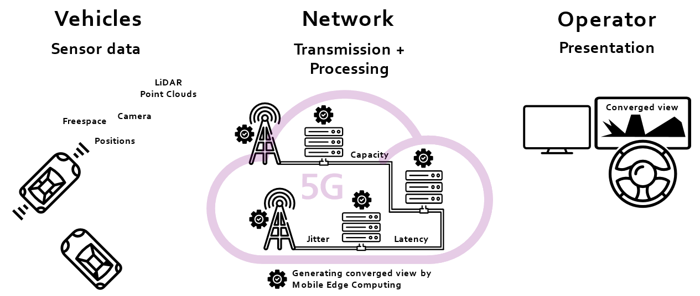

**Remote-Operated Driving** is the bridge technology from human towards fully automated driving. 
In situations outside the driving domain of a highly-automated vehicle, e.g. if data is missing or the autonomous function is unsure to
make a certain decision, remote-operation is the key. Also, in other use-cases, remote-operated driving is a helpful 
technique, e.g. for driving electric car-sharing vehicles to their charging stations, or maneuvering vehicles remotely through
a parking garage. 

In all those use-cases, a human operator would "steer" the vehicle remotely. All sensor information would be sent over the 5G network
to the operator who can then decide on the action or trajectory the vehicle should follow. The information the operator 
receives could be any sensor data from the vehicle, such as camera data, LiDAR data, 
or already compiled information like detected objects and free space.
With Mobile Edge Computing and sensor fusion, the information could be enriched by other vehicles or stationary sensors.

Virtual Testing with MOSAIC helps to dive deeper into this topic. This study bases on LiDAR data for presentation of the operator view, 
which allows selecting different viewing angles as well as sensor fusion of different perspectives from other vehicles for a 
holistic environment model. The final result can be seen in the video below.



 

Eclipse MOSAIC has been used to couple the vehicle simulator PHABMACS with the MOSAIC Application
simulator, in which a custom application has been deployed providing the operator view.
The vehicle simulator PHABMACS is responsible for vehicle dynamics and sensor data, in this case LiDAR data.
The message exchange of LiDAR as well as vehicle control data has been simulated by integrating the MOSAIC Cell simulator.
In this way, we could analyze the influence of communication properties, e.g. latencies and 
different connection qualities such as low capacities or packet losses, on the application. 
For the hybrid test setup with virtual world and real application for the human operators, 
the whole simulation has to run in real time, which is possible with Eclipse MOSAIC (see parameter `--realtime-brake 1`).

