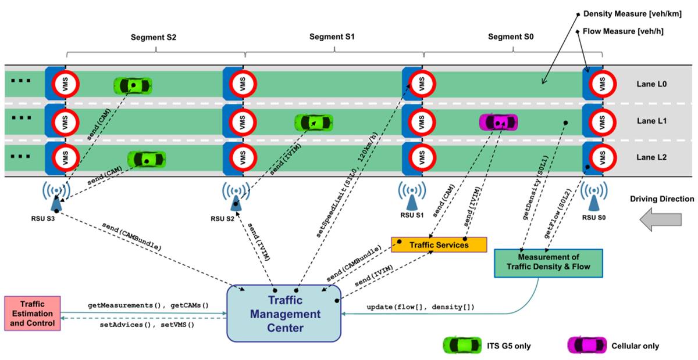

**The simulative investigation of communication-based Traffic Management solutions requires combining models from different domains. Eclipse MOSAIC suits very well for this purpose as it couples multiple simulators to model vehicle movement pattern, infrastructure sensors, (variable) traffic signs, as well as different communication links (ITS-G5, 4G/5G) between vehicles and backends, and the application logic in entities like vehicles and a Traffic Management Center.**

In a recent study, we analyzed future traffic estimation and control algorithms towards their use on highways 
with special focus on mixed traffic of conventional vehicles, connected vehicles, and autonomous vehicles. Connected 
vehicles share telematic information with a Traffic Management Center (TMC) which can then estimate the traffic state 
and initiate control mechanisms to improve traffic efficiency either via variable message signs as part of the infrastructure, or via V2X communication directly addressing connected vehicles in order to share 
speed and lane change advices with the vehicles on the road (e.g. via ETSI IVI message). In a further step, 
dynamic lane assignments have been established, which dedicate lanes to autonomous vehicles only to enable 
efficient platooning maneuvers. The individual highlights of Eclipse MOSAIC for simulating such a traffic management system are visualized in the video.

<video controls style="width:55%">
  <source src="https://owncloud.fokus.fraunhofer.de/index.php/s/LclLTzGQ0BdziIn/download" type="video/mp4">
</video>

With **Eclipse MOSAIC** this system has been modelled and simulated with all its various aspects in order to analyze 
efficiency improvements of such estimation and control algorithms. As traffic simulator, we employed 
**[Eclipse SUMO](/docs/simulators/traffic_simulator_sumo)**, which already provides a basic 
model for variable *speed* signs. However, the preferred [MOSAIC VMS Simulator](/docs/simulators/vms_simulator) 
realizes a more flexible concept with the dynamic control of the VMS during simulation runtime, including *arbitrary sign semantics* additional 
to *speed* and featuring a visibility range. The interplay of information from infrastructure elements as well as communicated information 
has been modelled in detail with applications covering realistic behavior of human drivers and autonomous vehicles. Additionally, 
real estimation and control algorithms from external suppliers have been integrated into the simulation to 
provide a software-in-the-loop environment. The **[MOSAIC Mapping](docs/simulators/application_mapping)** 
allowed for a comprehensive configuration of the different application components to the simulated entities (variously equipped vehicles, RSUs and a TMC cloud server).

The final result was a complex simulation scenario for Eclipse MOSAIC, 
including a calibrated traffic model, various application and behavior models for automated, connected and conventional vehicles, 
 different communication links via ITS-G5 and cellular communication, infrastructure models for sensors and variable message signs, and 
a new evaluation component in order to gain statistics out of a simulation.

| Requirement | [SUMO](/docs/simulators/traffic_simulator_sumo) | [MOSAIC Application](/docs/simulators/application_simulator) | [MOSAIC Cell](/docs/simulators/network_simulator_cell) | [MOSAIC SNS](/docs/simulators/network_simulator_sns) | [MOSAIC VMS](/docs/simulators/vms_simulator) | [MOSAIC Output](/docs/visualization/statistics) |
|:---|:---:|:---:|:---:|:---:|:---:|:---:|
| Simulate Vehicle Traffic on Highways | X |  |  |  |  |  |
| Measure Traffic Properties (Flow, Density) | X |  |  |  |  |  |
| Control Traffic dynamically via VMS | (X) | X |  |  | X |  |
| Exchange V2X Messages via ITS-G5 and 4G/5G |  |  | X | X |  |  |
| Include Vehicle Functions which react on IVIM  |  | X |  |  |  |  |
| Model Traffic Management Center Facilities |  | X |  |  |  |  |
| Integrate real TMC algorithms in Simulation |  | X |  |  |  |  |
| Include Roadside Units with custom Functionality |  | X |  |  |  |  |
| Generate aggregated Statistics from the Simulation |  |  |  |  |  | X |
| Generated Detailed Simulation Logs | (X) |  |  |  |  | X |

### The Simulation Setup

The traffic model in this scenario has been created using real toll-data for the highway AP7 in northern Spain, provided 
by the Spanish toll road management ([Abertis Infraestructuras, S.A.](https://www.abertis.com)). Based on this data, traffic has been 
generated in Eclipse SUMO and calibrated in a way,
that the simulated traffic resembles the original toll data as close as possible. This procedure has been done for the 
complete highway AP7 and resulted in more than 500.000 vehicles per day in the simulation. However, it would not make real sense 
to analyze a whole highway stretch, as the control algorithms under test apply very local changes. Therefore, we decided to extract
a reduced traffic scenario from the calibrated one by measuring the vehicle movements within a smaller area only. Based on those
measurements we were able to create a realistic traffic model on a stretch of 25 kilometers length near Girona.



For modelling the infrastructure, the highway has been divided into so-called segments. Each segment, roughly 500m in length, contains
spot sensors at the entry of each segment to measure traffic flow, lane area detectors which model cameras to measure traffic density, and
Variable Message Signs (VMS) displaying speed limits and lane assignments. Modelling VMS was achieved by the new
simulator **MOSAIC VMS**, which let vehicles "see" oncoming traffic signs showing speed limits or lane assignments. An additional
behavior model for vehicles implemented in the MOSAIC Application Simulator could react on those instructions accordingly.

The segmentation of the highway was very important for the traffic estimation and control algorithms which have been integrated into the scenario. Those 
algorithms, provided by the [Technical University of Crete](https://www.pem.tuc.gr/index.php?id=5257), can
estimate the traffic volume on highways using traditional sensors, but also by receiving CAM messages of connected vehicles. Based on the
traffic estimation, additional algorithms can control the traffic by setting speed limits on VMS, or by sending V2X messages (e.g. ETSI IVI messages)
with speed recommendations or lane change advices to individual vehicles. The control algorithms were written in C++ and have already been used in real 
traffic management centers. For this study, we integrated them into the [MOSAIC Application](/docs/simulators/application_simulator) 
Simulator using the Java Native Interface (JNI).



The estimation algorithms rely on information from vehicles and control algorithms are able to send back advices. Therefore, communication
links are required to exchange V2X messages. To achieve this, two separate communications links have been modelled by integrating 
the **[MOSAIC Simple Network Simulator](/docs/simulators/network_simulator_sns)** for ITS-G5 communication, 
and the  **[MOSAIC Cell Simulator](/docs/simulators/network_simulator_cell)** for cellular communication (e.g. 5G or LTE-V2X).
In the former case, vehicles exchanged message with Road Side Units along the road, which then forwarded the information to the Traffic Management
Center (TMC). In the latter case, vehicles were directly connected to the TMC.

Finally, application models for connected and automated vehicles have been integrated by using the 
**[MOSAIC Application Simulator](/docs/simulators/application_simulator)**. With the help of these applications
vehicles could react on advices sent by the TMC. Depending on the SAE level of the vehicle in the simulation, the vehicles
would execute a certain advice immediately after some safety checks (fully automated vehicle) or with a certain delay 
(connected vehicle with a human driver reacting on a lane-change advice).

### Evaluations

In a first study, we took a closer look onto the main traffic flow control (MTFC) in general. This algorithm measures the traffic volume
on the highway and adjusts the speed limits shown on VMS based on the current flow and density. In many cases, traffic collapses
near on-ramps when traffic flow on the highway is already high and additional vehicles are entering, resulting in a capacity drop
on the highway and thereby congestion further upstream. To avoid this from happening, the controller reduces the average speed
of the main flow resulting in more capacity available at the bottleneck. This effect could be shown in MOSAIC with the setup described 
above as well, as shown in the Figure below. Here you can see, that the congestion which arises at the bottleneck near segment 30 can
be reduced by activating the controller.



In the previous case, the controller adjusted the speed limit shown on VMS along the highway. Those VMS were placed virtually every
500m along the highway, which would be very expensive to implement on real highways. Therefore, we reduced the number of 
VMS placed along the highway and tested the algorithm again. VMS were now placed at strategic positions rather than equidistant. To be more 
precisely, five VMS were placed between two consecutive on-ramps, having one VMS to control the speed near the bottleneck, three safety VMS which reduce 
the speed stepwise further upstream, and one VMS after the on-ramp to release the vehicles from the control area. As a result, we
could spare over 60% of the VMS placed along the specific highway stretch without seeing much difference in the results.

 

In addition to controlling the traffic by setting VMS, vehicles do receive speed limits or speed advices via communication using IVI messages. 
Those messages contain control decisions for each segment and are spread to the vehicles using ITS-G5 adhoc communication. For this purpose, 
the simulation scenario is modelled in a way, that a road side unit is placed at each segment entry. Equipped vehicles adjust their speeds and
therefore control the traffic flow as a whole, as other vehicles (e.g. their followers) are forced to adjust their speeds as well. With this fact
given, we did another experiment in which we eliminated all VMS completely and sent speed limits only via V2X communication to
equipped vehicles. This, on one hand, already works with rather low penetration rates of 15 percent equipped vehicles, as shown in the Figure 
below. Furthermore, the higher the penetration rate is, the better the controller works. For high penetration rates, this technique even surpasses the classic
approach via VMS slightly, as connected vehicles can react and controlled more precisely.



### Conclusion

We modelled complex traffic scenarios including road infrastructures (sensors, dynamic traffic signs, road side units), individual driving
behavior for different SAE levels. Furthermore, we integrated real algorithms for traffic estimation and control into MOSAIC Application
enabling software-in-the-loop tests. By creating and calibrating a highway scenario using real toll data, we could test different
traffic control techniques which showed that traffic flow on highways could be improved, even with novel approaches which do not
rely on classic infrastructure such as road sensors and Variable Message Signs, but almost solely on V2X communication.

---

This work was part of the [INFRAMIX](https://www.inframix.eu) project. INFRAMIX has received funding from
the European Union's Horizon 2020 research and innovation programme under grant
agreement no 723016. 

