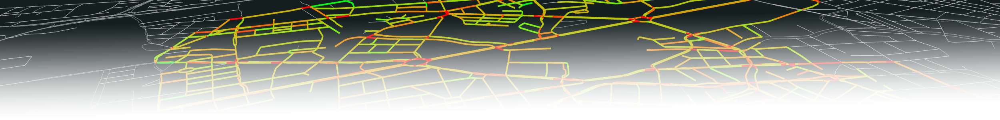

**Daily commutes can quickly turn into stressful affairs when overcrowded roads become congested and what would be a 20 minute ride becomes an hour of staring at the license plate of your fellow comrade-in-traffic.
Real-time Traffic State Estimation (TSE) aims to alleviate this strain by predicatively recognizing congested areas and offering alternative routing options. In a recent publication we established a framework for easy implementation and evaluation of novel TSE systems.**

    

        <!-- GitHub Icon -->
        <svg xmlns="http://www.w3.org/2000/svg" viewBox="0 0 16 16" fill="currentColor" style="width: 40px; height: 40px;">
          <path fill-rule="evenodd" d="M8 0C3.58 0 0 3.58 0 8c0 3.54 2.29 6.53 5.47 7.59.4.07.55-.17.55-.38 0-.19-.01-.82-.01-1.49-2.01.37-2.53-.49-2.69-.94-.09-.23-.48-.94-.82-1.13-.28-.15-.68-.52-.01-.53.63-.01 1.08.58 1.23.82.72 1.21 1.87.87 2.33.66.07-.52.28-.87.51-1.07-1.78-.20-3.64-.89-3.64-3.95 0-.87.31-1.59.82-2.15-.08-.20-.36-1.02.08-2.12 0 0 .67-.21 2.2.82.64-.18 1.32-.27 2-.27.68 0 1.36.09 2 .27 1.53-1.04 2.20-.82 2.20-.82.44 1.10.16 1.92.08 2.12.51.56.82 1.27.82 2.15 0 3.07-1.87 3.75-3.65 3.95.29.25.54.73.54 1.48 0 1.07-.01 1.93-.01 2.20 0 .21.15.46.55.38A8.013 8.013 0 0 0 16 8c0-4.42-3.58-8-8-8z"/>
        </svg>
        <!-- GitHub Link -->
        <a href="https://github.com/mosaic-addons/traffic-state-estimation" target="_blank" style="border: 2px; border-radius: 5px; margin: auto 5px auto 5px; text-decoration: none; color: #68145C; font-weight: bold;">GitHub Repository</a>
    

    

Nowadays, people have become used to having access to real-time traffic information in the palm of their hands using their smartphones.
However, navigation applications like Google Maps© rely on large amounts of user data and don't publish the algorithms used to retrieve the traffic information.
In an effort to make the implementation and evaluation of such Traffic State Estimation (TSE) systems more accessible, we developed an application tool chain for Eclipse MOSAIC that enables 
quick prototyping in a simulated environment. They applications have been designed to be easily extendable so that you can develop your own TSE methods and compare them against results from conventional soluation.
For this purpose, we published all generated code on GitHub under the EPL-License, allowing free usage, customization, and deployment.

▶&emsp;<a href="https://github.com/mosaic-addons/traffic-state-estimation">https://github.com/mosaic-addons/traffic-state-estimation</a>&emsp;◀

### Research
The developed framework laid the foundation for our paper at the [EAI SIMUtools 2023](https://simutools.eai-conferences.org/2023/) conference, which received the **Best Paper Award**.
In the paper, we aimed at reviewing commonly used sensors for Traffic State Estimation in an urban environment.
All experiments were conducted on-top the traffic simulator Eclipse SUMO and the calibrated [BeST Scenario](https://github.com/mosaic-addons/best-scenario) with traffic in the city of Berlin.
We compared mean speed estimates from traditional induction loops with now broadly adapted Floating Car Data (FCD) retrieved from connected vehicles.

Furthermore, we identified that different sensor technologies require different ways of aggregating measured samples.
When using conventional induction loops, the Time and Space Mean Speed are commonly used, which are built by calculating the arithmetic and harmonic mean of samples measured within a time interval.
For FCD-based methods, we identified metrics defined by Yoon et al.[^1], namely the Temporal and Spatial Mean Speeds.
By comparing these values on different road types, we concluded that on highway-like streets with continuous traffic flow all metrics function equivalently.
However, especially if roads are signalized, conventional induction loop methods fail to properly capture the ground truth.

{{< figure src="./plot_all_streets.png" width="100%" title="Speed estimates on different road segments in Berlin Charlottenburg. Where $V_{GT}\hspace{0.1cm}$ represents the ground truth speed retrieved from SUMO. $V_{TMS}\hspace{0.1cm}$ and $V_{SMS}\hspace{0.1cm}$ are the time and space mean speed, retrieved from virtual induction loops. $V_{\text{temporal}}\hspace{0.1cm}$ and $V_{\text{spatial}}\hspace{0.1cm}$ are the temporal and spatial mean speed calculated using received FCD.">}}

Additionally, as part of our research, we also looked into required market penetration rates that can be used to still deliver reliable TSE. 
We managed to reproduce results cited in literature and concluded that depending on the road type, reliable TSE requires a market penetration rate of 5–10% for city traffic.

More details can be found in the paper >>Spatio-Temporal Speed Metrics for Traffic State Estimation on Complex Urban Roads<<.

[^1]: Yoon, J., Noble, B., Liu, M.: Surface street traffic estimation. In: Proceedings of the 5th international conference on Mobile systems, applications and services. pp.220–232 (2007)
### System Design
Below, a simplified system overview is depicted. Using MOSAICs Mapping, we can equip however many vehicles with the *FcdTransmitterApp*, which
will cause them to periodically record their positions, speeds, headings in the form of Floating Car Data and transmit it to the *TseServerApp*.
At the heart of the server application runs a *TseKernel* which handles the reception of FCD, traversal detection, and supervision of processors.
The kernel has been designed in a way to be easily extensible with custom processors that can individually handle received FCD and implement your own TSE metrics.
Currently, results will be stored in an SQLite database.



### What's next?
In our current investigations, we only regarded calibrated traffic without major obstructions to measure mean speeds throughout the day.
However, the detection of said obstructions is one of the core use cases for TSE, so we aim to introduce and evaluate these in the future.

More importantly, we are also interested in providing reliable TSE with even smaller market penetration rates by improving the data quality.
We aim to achieve this by using data from vehicular perception sensors (cameras, lidar) to enrich the Floating Car Dataset.

▶&emsp;<a href="https://github.com/mosaic-addons/traffic-state-estimation">https://github.com/mosaic-addons/traffic-state-estimation</a>&emsp;◀

___
This work is related to our research in the [KIS'M Project](https://bmdv.bund.de/SharedDocs/DE/Artikel/DG/AVF-projekte/kis-m.html).

